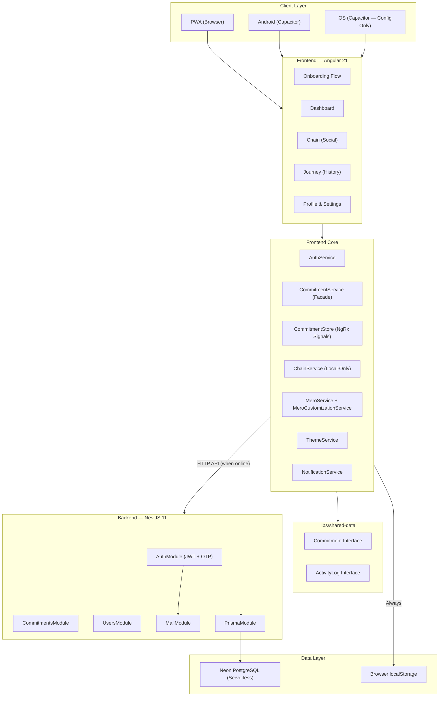
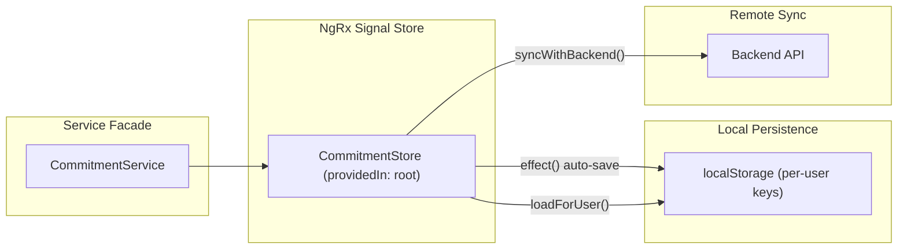
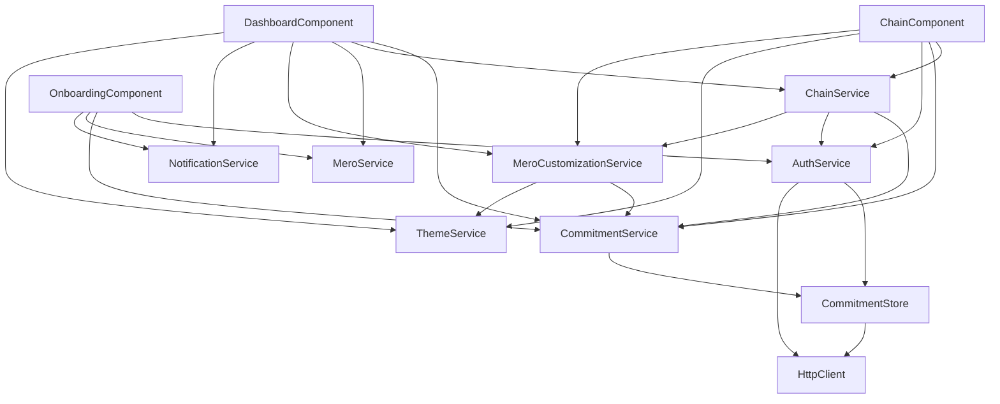
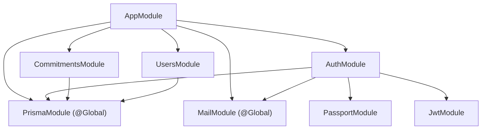
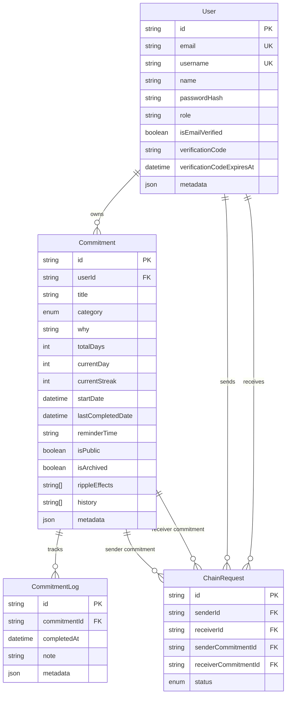
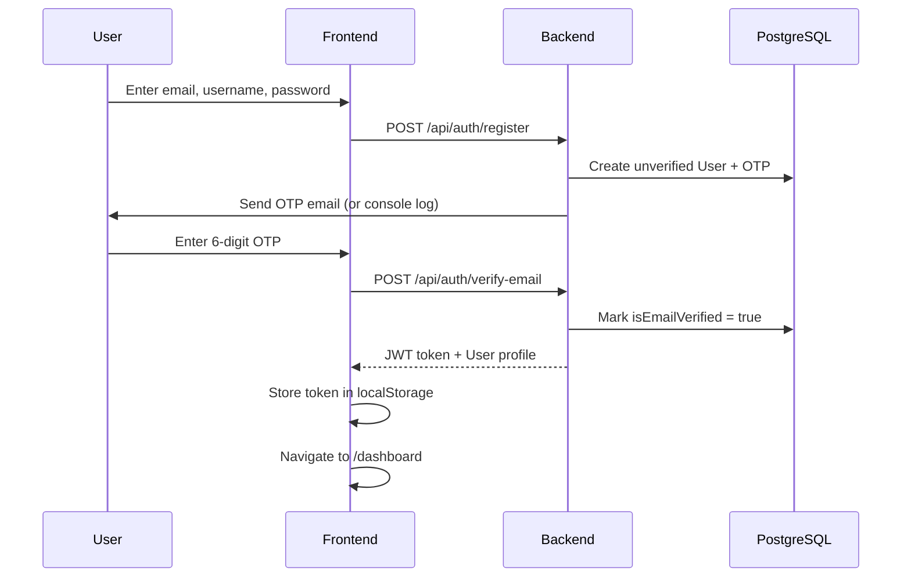
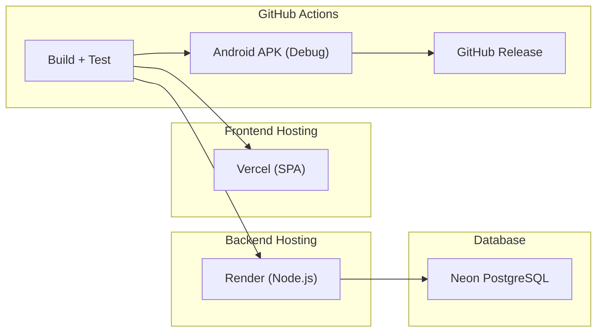

# MehrChain — Architecture Analysis & Dependency Map

> **Version:** v0.9.0-preview  
> **Generated:** September 2026  
> **Scope:** Full-stack Nx monorepo (Angular 21 + NestJS 11 + Capacitor 8)

---

## 1. High-Level System Architecture



---

## 2. Monorepo Project Structure

```
mehrchain/                          # Nx Monorepo Root
├── apps/
│   ├── mehrchain-frontend/         # Angular 21 PWA + Capacitor
│   │   └── src/app/
│   │       ├── core/               # Services, Store, Guards, Interceptors
│   │       ├── features/           # Onboarding, Dashboard, Chain, Journey, Profile
│   │       ├── shared/             # Reusable components, UI primitives, directives
│   │       └── environments/       # API URL configs
│   ├── mehrchain-backend/          # NestJS 11 REST API
│   │   ├── prisma/                 # Schema + Migrations
│   │   └── src/app/
│   │       ├── auth/               # JWT auth, OTP verification, passport strategy
│   │       ├── commitments/        # Habit CRUD + completion tracking
│   │       ├── users/              # User search & public profile
│   │       ├── mail/               # OTP email (console fallback)
│   │       ├── prisma/             # Global DB service
│   │       └── common/             # Exception filters
│   └── mehrchain-backend-e2e/      # E2E test scaffold (empty)
├── libs/
│   └── shared-data/                # Shared TS interfaces (Commitment, ActivityLog)
├── android/                        # Capacitor Android project
├── ios/                            # Capacitor iOS project (config only)
└── docs/                           # Landing page assets
```

---

## 3. Frontend Architecture Deep-Dive

### 3.1 Feature Modules

| Feature | Route | Lazy Loaded | Guard | Key Dependencies |
|---------|-------|-------------|-------|------------------|
| **Onboarding** | `/` | ❌ (eagerly loaded) | — | AuthService, MeroService, NotificationService |
| **Dashboard** | `/dashboard` | ✅ | `onboardingGuard` | CommitmentService, ChainService, MeroService, ThemeService |
| **Chain** | `/chain` | ✅ | `onboardingGuard` | ChainService, AuthService, QrCodeComponent |
| **Journey** | `/journey` | ✅ | `onboardingGuard` | CommitmentService, HeatmapCalendarComponent |
| **Profile** | `/profile` | ✅ | `onboardingGuard` | AuthService, MeroCustomizationService, ThemeService |

### 3.2 State Management Architecture



**Key Pattern:** Optimistic updates with local-first persistence. The store applies changes locally first, then attempts to sync with the backend API. If the backend is unreachable, data persists in localStorage.

### 3.3 Service Dependency Graph



### 3.4 Shared UI Component Library

| Component | Location | Purpose |
|-----------|----------|---------|
| `BadgeComponent` | `shared/ui/badge/` | CVA-based variant badges |
| `ButtonComponent` | `shared/ui/button/` | CVA-based variant buttons |
| `CardComponent` | `shared/ui/card/` | CVA-based card containers |
| `CommitmentCardComponent` | `shared/components/commitment-card/` | Habit card with progress, streak, actions |
| `MeroComponent` | `shared/components/mero/` | Animated mascot with glow themes |
| `HeatmapCalendarComponent` | `shared/components/heatmap-calendar/` | Monthly grid tracker (Persian & Gregorian) |
| `NewCommitmentModal` | `shared/components/new-commitment-modal/` | Create habit modal |
| `EditCommitmentModal` | `shared/components/edit-commitment-modal/` | Edit habit modal |
| `DeleteConfirmationModal` | `shared/components/delete-confirmation-modal/` | Soft-delete confirmation |
| `QrCodeComponent` | `shared/components/qr-code/` | Chain invite QR code generator |
| `SwipeDirective` | `shared/directives/` | Touch swipe gesture handler |

---

## 4. Backend Architecture Deep-Dive

### 4.1 Module Dependency Graph



### 4.2 API Endpoints

| Method | Route | Auth | Description |
|--------|-------|------|-------------|
| `GET` | `/api` | Public | Health check |
| `POST` | `/api/auth/register` | Public | Register + send OTP |
| `POST` | `/api/auth/verify-email` | Public | Verify OTP → JWT |
| `POST` | `/api/auth/resend-verification` | Public | Resend OTP |
| `POST` | `/api/auth/login` | Public | Email/Username + Password → JWT |
| `GET` | `/api/auth/me` | JWT | Current user profile |
| `DELETE` | `/api/auth/account` | JWT | Delete account (cascade) |
| `GET` | `/api/commitments` | JWT | List active commitments |
| `POST` | `/api/commitments` | JWT | Create commitment |
| `PATCH` | `/api/commitments/:id/complete` | JWT | Complete today |
| `PATCH` | `/api/commitments/:id` | JWT | Update commitment |
| `GET` | `/api/commitments/archived` | JWT | List archived |
| `DELETE` | `/api/commitments/:id` | JWT | Soft-delete (archive) |
| `PATCH` | `/api/commitments/:id/restore` | JWT | Restore archived |
| `DELETE` | `/api/commitments/:id/permanent` | JWT | Hard delete |
| `GET` | `/api/users/search?q=` | JWT | Search users |
| `GET` | `/api/users/:username` | JWT | Public profile |

### 4.3 Database Entity Relationship Diagram



---

## 5. Cross-Cutting Concerns

### 5.1 Authentication Flow



### 5.2 Data Sync Strategy

| Scenario | Behavior |
|----------|----------|
| **Online with valid JWT** | Optimistic local update → sync to backend API |
| **Backend unreachable** | Local-only mode with localStorage persistence |
| **Local/mock token** | No backend calls; pure offline operation |
| **Session restore** | Load from localStorage → background sync with backend |

### 5.3 PWA & Offline Strategy

- **Service Worker:** Angular NGSW with `prefetch` for app shell, `lazy` for assets
- **API Caching:** `freshness` strategy with 3s timeout → fallback to cached data (max 3 days)
- **Cached endpoints:** `/api/commitments/**`, `/api/auth/me`

---

## 6. Deployment Architecture



| Component | Platform | Tier | Status |
|-----------|----------|------|--------|
| Frontend | Vercel | Free | Configured (not actively deployed) |
| Backend | Render | Free | Configured (not deployed — no domain) |
| Database | Neon | Serverless | Configured |
| Android APK | GitHub Actions | Free | ✅ Working CI/CD pipeline |
| iOS | — | — | Config only, not built |

---

## 7. Technology Stack Summary

| Layer | Technology | Version |
|-------|-----------|---------|
| **Monorepo** | Nx | 22.5.0 |
| **Frontend Framework** | Angular | 21.0.0 |
| **State Management** | NgRx Signals | 22.0.1 |
| **Styling** | Tailwind CSS 4 + PostCSS | 4.1.12 |
| **Mobile** | Capacitor | 8.5.0 |
| **Icons** | Lucide Angular | 0.563.0 |
| **UI Primitives** | CVA (class-variance-authority) + tailwind-merge + clsx | — |
| **Backend Framework** | NestJS | 11.0.0 |
| **ORM** | Prisma | 6.19.2 |
| **Database** | PostgreSQL (Neon) | Serverless |
| **Auth** | Passport JWT + bcryptjs | — |
| **API Docs** | Swagger / OpenAPI | — |
| **Frontend Tests** | Vitest | 4.0.8 |
| **Backend Tests** | Jest | 30.0.2 |
| **TypeScript** | — | 5.9.2 |
| **CI/CD** | GitHub Actions | — |
