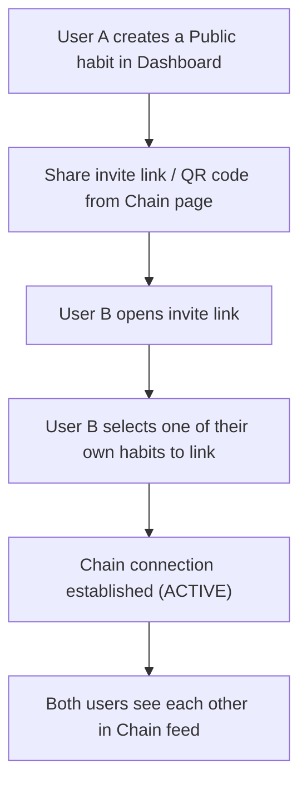
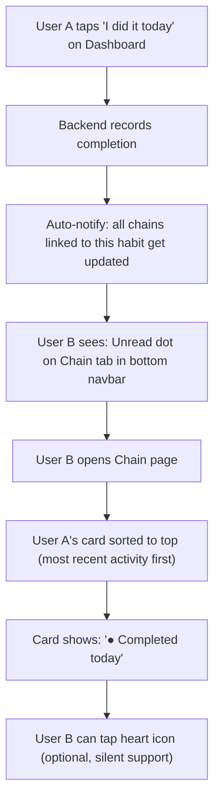
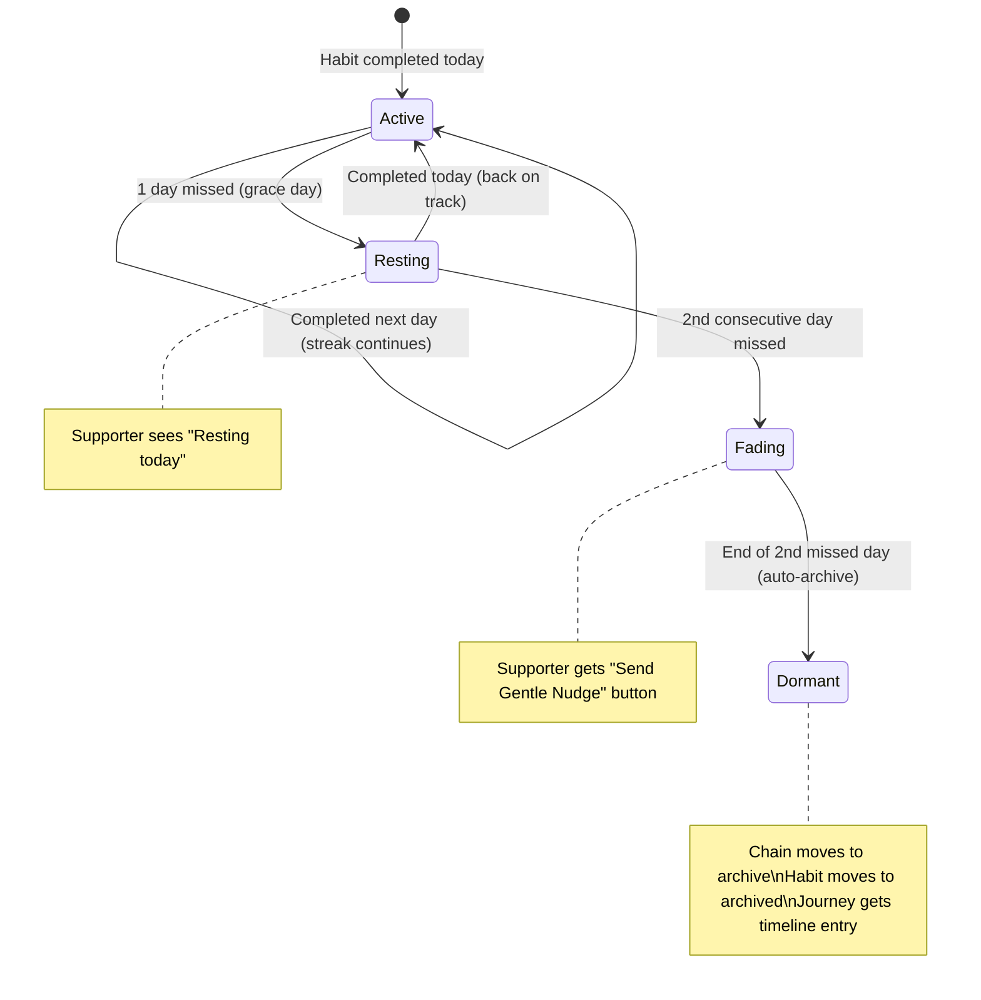
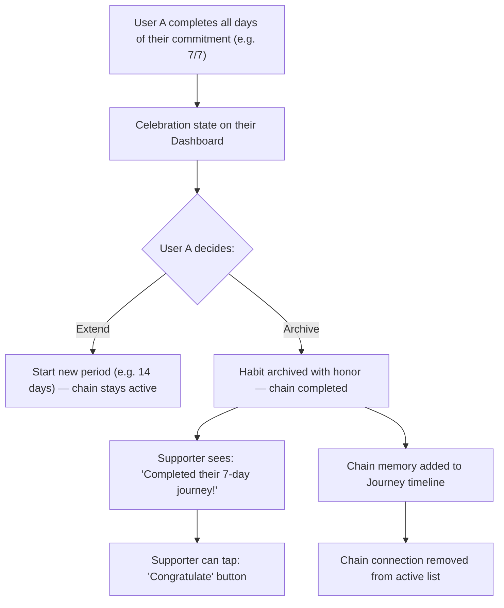

# Chain Feature — Design Specification

> This document defines the complete design, UX flow, data model, and implementation plan for the MehrChain Chain feature based on product decisions made during the design interview.

---

## 1. Core Concept

**Chain** is a support network, not a social feed or competition board.

| Principle | Rule |
|-----------|------|
| **Support, not competition** | No streak display for partners. Only "completed today" or "not yet" |
| **Minimal UI** | No emoji clutter. Use Lucide line icons with brand teal color |
| **Passive feed** | Card is informational. Action buttons only appear when contextually needed |
| **Automatic notify** | Completing a habit auto-notifies all linked chains — no separate button |
| **Gentle nudge** | Supporter can nudge only when partner has been absent 2 days or finished their period |

---

## 2. User Flow

### 2.1 Creating a Chain



### 2.2 Daily Completion Flow



### 2.3 Freeze & Dormant Flow



**Key rules:**
- **Day 1 missed (Resting):** Card shows `○ Resting today`. No action button for supporter.
- **Day 2 missed (Fading):** Supporter sees a contextual button: `Send Gentle Nudge`. The nudge reminds the user of their own "Why" (if they wrote one when creating the habit), or sends a warm generic message.
- **After Day 2 (Dormant):** Chain connection is **archived** (not deleted). The user's habit is also **archived**. To resume, they must create/restore the habit AND send a new chain invite.
- Chain memories appear in the **Journey** page timeline.

### 2.4 Period Completion Flow



---

## 3. Card Design — Minimal Wireframe

### 3.1 Normal State (partner completed today)

```
┌─────────────────────────────────────────────┐
│  [S]  @sara                              ♡  │
│       Morning Meditation (20m)               │
│                                              │
│  ● Completed today                           │
└─────────────────────────────────────────────┘
```

- `[S]` = Avatar circle with first letter
- `♡` = Lucide Heart icon (outline). Tap to fill (silent support)
- `● Completed today` = Green dot + status text
- No buttons, no emojis, no extra text

### 3.2 Not Yet Today

```
┌─────────────────────────────────────────────┐
│  [S]  @sara                              ♡  │
│       Morning Meditation (20m)               │
│                                              │
│  ○ Waiting for today's spark                 │
└─────────────────────────────────────────────┘
```

### 3.3 Resting (1 day missed)

```
┌─────────────────────────────────────────────┐
│  [S]  @sara                              ♡  │
│       Morning Meditation (20m)               │
│                                              │
│  ◐ Resting today                             │
└─────────────────────────────────────────────┘
```

### 3.4 Fading (2 days missed — nudge available)

```
┌─────────────────────────────────────────────┐
│  [S]  @sara                              ♡  │
│       Morning Meditation (20m)               │
│                                              │
│  ◌ 2 days away                               │
│                                              │
│  [ Send Gentle Reminder ]                    │
└─────────────────────────────────────────────┘
```

- Button appears **only** in this state
- Nudge message includes their "Why" if available:
  - With Why: *"Sara reminded you why you started: 'To feel calmer every morning'"*
  - Without Why: *"Someone believes in you. Your presence here matters."*

### 3.5 Period Completed

```
┌─────────────────────────────────────────────┐
│  [S]  @sara                                  │
│       Morning Meditation (20m)               │
│                                              │
│  ✓ Completed their 7-day journey             │
│                                              │
│  [ Congratulate ]                            │
└─────────────────────────────────────────────┘
```

### 3.6 Three-dot Menu (⋯)

Always available via long-press or tap on card. Contains:
- `Disconnect` — remove chain connection
- `View linked habit` — see which of your habits is linked

---

## 4. Navbar Unread Indicator

```
┌──────────────────────────────────────┐
│  Home    Chain●    Journey   Profile  │
└──────────────────────────────────────┘
```

- Small teal dot (`●`) on the Chain tab icon when any chain partner has new activity since last visit
- Dot clears when user opens Chain page
- Stored locally: `lastChainVisitAt` timestamp

---

## 5. Sorting Logic

Cards in Chain page are sorted by:
1. **`lastActivityAt` DESC** — most recently active partner at top
2. Cards with unread updates get a subtle left-border highlight (teal)
3. After scrolling past, the highlight fades

---

## 6. Database Schema Changes

### Modified Prisma Model

```prisma
model ChainConnection {
  id                    String   @id @default(uuid())
  
  // Users
  userId                String   // The owner viewing this chain
  partnerId             String   // The chain partner
  
  // Linked habits
  userCommitmentId      String   // Owner's linked habit
  partnerCommitmentId   String   // Partner's linked habit
  
  // State
  status                ChainStatus @default(ACTIVE)
  consecutiveMissedDays Int         @default(0)
  lastPartnerActivityAt DateTime?   // For sorting feed
  lastNudgeSentAt       DateTime?   // Prevent spam nudges
  heartSent             Boolean     @default(false) // Today's heart
  
  // Timestamps
  createdAt             DateTime @default(now())
  archivedAt            DateTime?
  
  // Relations
  user                  User       @relation("UserChains", fields: [userId], references: [id])
  partner               User       @relation("PartnerChains", fields: [partnerId], references: [id])
  userCommitment        Commitment @relation("UserChainCommitment", fields: [userCommitmentId], references: [id])
  partnerCommitment     Commitment @relation("PartnerChainCommitment", fields: [partnerCommitmentId], references: [id])
  
  @@unique([userId, partnerId, userCommitmentId])
}

// Replace old ChainRequest with invite flow
model ChainInvite {
  id                  String            @id @default(uuid())
  senderId            String
  senderCommitmentId  String
  inviteCode          String            @unique @default(uuid())
  status              ChainInviteStatus @default(PENDING)
  acceptedById        String?
  acceptedCommitmentId String?
  createdAt           DateTime          @default(now())
  expiresAt           DateTime          // 7-day expiry
  
  sender              User       @relation(fields: [senderId], references: [id])
  senderCommitment    Commitment @relation(fields: [senderCommitmentId], references: [id])
}

enum ChainStatus {
  ACTIVE
  RESTING    // 1 day missed
  FADING     // 2 days missed (nudge window)
  COMPLETED  // Period finished successfully
  DORMANT    // Auto-archived after 2+ days
  DISCONNECTED // Manually disconnected
}

enum ChainInviteStatus {
  PENDING
  ACCEPTED
  EXPIRED
  CANCELLED
}
```

### Changes to Existing Models

```prisma
model Commitment {
  // ... existing fields ...
  
  // Add: track consecutive missed days for freeze logic
  consecutiveMissedDays Int @default(0)
  lastCompletedDate     DateTime?
  
  // Add: relations for chain connections
  userChains    ChainConnection[] @relation("UserChainCommitment")
  partnerChains ChainConnection[] @relation("PartnerChainCommitment")
  chainInvites  ChainInvite[]
}
```

---

## 7. API Endpoints

| Method | Route | Auth | Purpose |
|--------|-------|------|---------|
| `POST` | `/api/chain/invite` | JWT | Generate invite link for a public commitment |
| `GET` | `/api/chain/invite/:code` | — | Get invite details (public, for accepting) |
| `POST` | `/api/chain/invite/:code/accept` | JWT | Accept invite with own commitment ID |
| `DELETE` | `/api/chain/invite/:id` | JWT | Cancel own invite |
| `GET` | `/api/chain/connections` | JWT | List active chain connections (sorted by lastActivityAt) |
| `POST` | `/api/chain/connections/:id/heart` | JWT | Send heart (toggle, once per day) |
| `POST` | `/api/chain/connections/:id/nudge` | JWT | Send gentle nudge (only when partner is Fading/Completed) |
| `DELETE` | `/api/chain/connections/:id` | JWT | Disconnect chain |
| `GET` | `/api/chain/unread` | JWT | Check if any unread chain activity exists (for navbar dot) |

### Backend Cron Job

A daily scheduled task (e.g., midnight UTC) that:
1. For each active chain: check if partner completed yesterday
2. If not: increment `consecutiveMissedDays`
3. If `consecutiveMissedDays == 1`: set status to `RESTING`
4. If `consecutiveMissedDays == 2`: set status to `FADING`
5. If `consecutiveMissedDays > 2`: set status to `DORMANT`, archive the commitment, create Journey timeline entry

---

## 8. Frontend Component Changes

### Remove from Current Chain Page
- ❌ `Ring the Bell` button and badge
- ❌ `Send Love` / `Cheer` / `Nudge` multiple reaction buttons
- ❌ Activity text line (`Sara rang the bell & sent love!`)
- ❌ Demo chain (`+ Add Sample Demo`)
- ❌ Multiple emoji usage throughout

### New Chain Page Structure
```
chain/
├── chain.ts                    # Page: tabs (Active | empty state)
├── chain.html                  # Feed layout + invite section
├── components/
│   ├── chain-card.ts           # Single chain partner card (minimal)
│   ├── chain-card.html
│   ├── invite-section.ts       # Link sharing + QR
│   └── invite-section.html
```

### Remove from Profile Page
- ❌ `Personality` section (Energetic/Calm/Focused selector)
- Keep: Nickname, Glow Theme, Dark/Light Mode, Account actions

### Add to Journey Page
- Chain memory entries in the timeline: `"7 days chained with @sara — Morning Meditation"`

### Dashboard Card Changes
- ❌ Remove `Ring Bell` button from `CommitmentCardComponent`
- Completion auto-notifies chains (backend handles this)

---

## 9. Nudge Message Logic

When a supporter sends a nudge, the message is personalized:

```typescript
function buildNudgeMessage(partnerName: string, habitWhy?: string): string {
  if (habitWhy) {
    return `${partnerName} reminded you why you started: "${habitWhy}"`;
  }
  return `Someone believes in you. Your presence here matters.`;
}
```

- Nudge is rate-limited: max 1 per chain per 24 hours
- Nudge appears as an in-app notification (not push), matching the passive philosophy
- Stored in a simple `notifications` table for the recipient to see on next app open

---

## 10. Design Principles Summary

```
┌─────────────────────────────────────────────────────────┐
│                    CHAIN DESIGN RULES                    │
│                                                          │
│  1. No emojis (use Lucide icons only)                   │
│  2. No streak display for partners                      │
│  3. One action per card (contextual)                    │
│  4. Heart = silent, icon-only, one tap                  │
│  5. Nudge = only when partner is fading/completed       │
│  6. 2-day fixed freeze → auto-archive                  │
│  7. Chain memories live in Journey, not Chain page       │
│  8. Sorting by most recent activity                     │
│  9. Unread dot on navbar (passive notification)         │
│ 10. Ending is not failure — it's completing a chapter    │
└─────────────────────────────────────────────────────────┘
```
