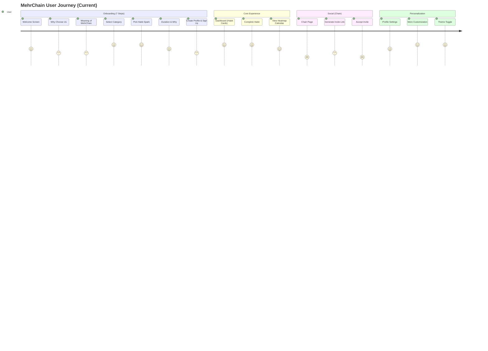
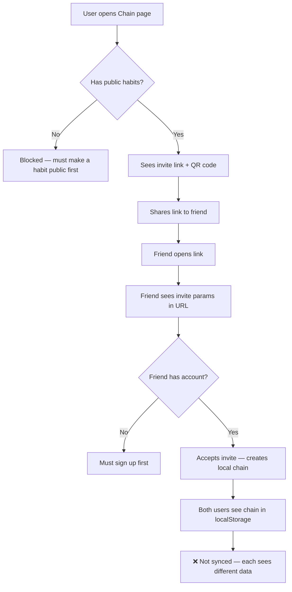
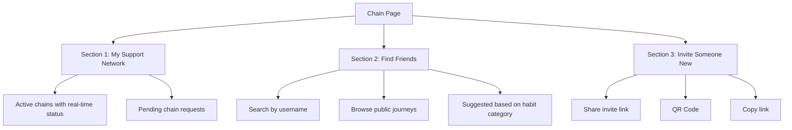

# MehrChain — UI/UX Heuristic Evaluation

> **Evaluation Date:** September 2026  
> **Methodology:** Nielsen's 10 Usability Heuristics + Competitive Benchmarking  
> **Scope:** All user-facing screens and interaction flows

---

## 1. User Journey Map



> [!NOTE]
> The journey score drops significantly at the Chain feature — this is the least developed and most confusing part of the UX, yet it's the product's key differentiator.

---

## 2. Nielsen's 10 Heuristics Evaluation

### H1: Visibility of System Status — ⭐⭐⭐ (3/5)

**What works:**
- Streak counter provides immediate feedback on consistency
- Mero mascot visually reacts to user actions (celebrating, happy, idle)
- Haptic vibration confirms habit completion
- Toast messages acknowledge actions

**What's missing:**
- No loading skeletons — data appears with a flash when loaded
- No sync indicator — user doesn't know if data reached the server
- No "last synced" timestamp visible to the user
- Heatmap calendar doesn't indicate today's position distinctly

---

### H2: Match Between System and Real World — ⭐⭐⭐⭐ (4/5)

**What works:**
- "Light your lamp" metaphor resonates with Rumi philosophy
- Category names (Health, Growth, Community, Environment) are intuitive
- "Ring the Bell" action is a natural metaphor for celebration

**What's missing:**
- "Chain" terminology may confuse users — is it a chain of habits? A social link? Blockchain?
- "Commitment" vs "Habit" — the app uses both terms inconsistently
- "Ripple Effects" concept is unclear without onboarding explanation

---

### H3: User Control and Freedom — ⭐⭐⭐ (3/5)

**What works:**
- Swipe gestures to navigate onboarding
- Archive (soft-delete) with restore capability
- Edit modal for existing habits
- Logout and account deletion available

**What's missing:**
- No "undo" after completing a habit (what if tapped accidentally?)
- Can't skip onboarding steps — must go through all 7 linearly
- No way to reorder habits on dashboard
- Can't dismiss incoming chain invite without explicit action

---

### H4: Consistency and Standards — ⭐⭐⭐ (3/5)

**What works:**
- Consistent use of Teal primary color throughout
- Dark/Light mode applied consistently
- Lucide icons used uniformly

**What's missing:**
- **No documented design system** — spacing, typography, and component variants aren't standardized
- Button styles vary across pages (some use `ButtonComponent`, some use inline Tailwind classes)
- Modal patterns differ — some close on backdrop click, some don't
- Navigation pattern isn't consistent — bottom nav? sidebar? Neither is clearly established

---

### H5: Error Prevention — ⭐⭐⭐⭐ (4/5)

**What works:**
- Duplicate habit completion prevented (can only mark once per day)
- Email validation with DNS MX check prevents fake registrations
- Delete confirmation modal prevents accidental deletion
- Password minimum length enforced

**What's missing:**
- No character limit feedback on habit title during input
- No validation on reminder time (can set past times)
- OTP field accepts any text — should be restricted to digits only

---

### H6: Recognition Rather Than Recall — ⭐⭐⭐⭐ (4/5)

**What works:**
- Pre-built habit suggestions per category reduce cognitive load
- Category icons (Heart, Leaf, Users, TrendingUp) are instantly recognizable
- Duration presets (7, 14, 21 days) simplify choices

**What's missing:**
- Chain page shows invite URL but doesn't visually explain the concept
- No contextual tooltips explaining features like "isPublic" or "Ripple Effects"

---

### H7: Flexibility and Efficiency — ⭐⭐⭐ (3/5)

**What works:**
- Custom habit input available alongside suggestions
- Custom duration beyond presets supported
- QR code generation for quick sharing

**What's missing:**
- No batch operations (complete multiple habits at once)
- No keyboard shortcuts
- No quick-add (floating action button or gesture-based)
- No widget for Android home screen completion

---

### H8: Aesthetic and Minimalist Design — ⭐⭐⭐⭐ (4/5)

**What works:**
- Clean, spacious layout with Poppins typography
- Mero glow themes add visual delight without clutter
- Dark mode is well-crafted with proper contrast
- Card-based design creates clear visual hierarchy

**What's missing:**
- Onboarding screens feel text-heavy — could use more illustrations
- Chain page has dense UI when invite + friend chains are both visible
- No visual hierarchy between primary and secondary actions in modals

---

### H9: Help Users Recognize, Diagnose, and Recover from Errors — ⭐⭐⭐ (3/5)

**What works:**
- Inline error messages on sign-up form
- Specific error messages ("This email is already registered", "Invalid verification code")
- Duplicate email detection with "Sign in instead?" prompt

**What's missing:**
- Network errors show console warnings but no user-facing messages
- If API sync fails, user sees no indication — data silently stays local
- No retry button when API calls fail
- No "offline mode" banner indicating reduced functionality

---

### H10: Help and Documentation — ⭐⭐ (2/5)

**What works:**
- Onboarding explains the product philosophy
- Swagger docs available for developers at `/api/docs`

**What's missing:**
- No in-app help or FAQ
- No explanation of the Chain feature workflow
- No tips or hints on first use of features
- No "What is MehrChain?" section accessible after onboarding
- No changelog or "what's new" for returning users

---

## 3. Competitive Positioning Analysis

### MehrChain vs Key Competitors

| Feature | MehrChain | Habitify | Duolingo | Balance/Happier |
|---------|-----------|----------|----------|-----------------|
| **Core Purpose** | Mental health + habits + social good | Habit tracking | Language learning | Meditation & wellness |
| **Onboarding** | 7 steps (sign-up required) | 2-3 steps (quick start) | 3 steps (immediate first lesson) | 3 steps (personalization quiz) |
| **Time to First Value** | ~3-5 min | ~30 sec | ~1 min | ~2 min |
| **Mascot/Companion** | Mero (emoji-based, 7 themes) | ❌ | Duo (full character, animated) | ❌ |
| **Gamification** | Streak + glow unlock | Streak + stats | XP + leagues + streak freeze | Progress bars + certificates |
| **Social Features** | Chain (partially built) | ❌ | Leaderboards, friends | Community circles |
| **Offline Support** | localStorage cache | Full offline | Limited | Some offline |
| **Accessibility** | Basic | Good | Excellent | Good |
| **Design System** | Informal (CSS variables) | Polished | Mature design system | Polished |

### Key Takeaways from Competitors

1. **Duolingo's strength** isn't the content — it's the emotional loop. Duo's personality and the daily streak anxiety keep users coming back. MehrChain's Mero has this potential but needs more emotional range and narrative.

2. **Habitify's strength** is speed — you can add and complete a habit in under 10 seconds. MehrChain's 7-step onboarding is a friction barrier.

3. **Balance/Happier's strength** is tone — they make you feel safe and supported, not judged. MehrChain's philosophy aligns with this but the UI doesn't yet convey warmth at every touchpoint.

---

## 4. Mero Mascot System Evaluation

### Current State

| Aspect | Implementation | Assessment |
|--------|---------------|------------|
| **Emotional States** | idle, content, happy, waiting, celebrating, sleepy, missing | Good range |
| **Visual** | Emoji-based (🙂🥰🤩👀) | Functional but limited personality |
| **Glow Themes** | 7 pre-built + 1 custom (unlockable by streak) | Excellent gamification |
| **Personality System** | Energetic/Calm/Focused with unique greeting text | Creative and differentiating |
| **Contextual Reactions** | Celebrates on habit completion, waits during onboarding | Good foundation |

### Recommendations for Mero

1. **Upgrade from emoji to illustrated character** — even a simple SVG face with expressions would create stronger emotional connection (see Duolingo's Duo evolution)
2. **Add Mero dialogue bubbles** — short motivational messages based on streak, time of day, and personality
3. **Missing/sleepy states** are defined but not visibly triggered — implement "we miss you" re-engagement
4. **Streak milestone celebrations** — special Mero animations at 7, 14, 21 day milestones
5. **Mero should appear on the Chain page** — guide users through the social experience

---

## 5. Chain Feature — UX Deep-Dive

### The Core Problem

The Chain feature is MehrChain's **key differentiator** — it transforms a solo habit tracker into a social support network. However, the current UX has significant gaps:



### Specific UX Issues

1. **No clear explanation** of what "Chain" means — the page jumps straight to invite generation
2. **Dead-end for new users** — if you have no public habits, the page is essentially empty
3. **Invite flow requires URL sharing** — no in-app discovery or user search integration
4. **Chain connections are local-only** — User A accepts an invite, but User B doesn't see the connection
5. **Demo chain** (`@sara`) is confusing — is this a real person? Why can I toggle their completion?
6. **Reactions (heart/cheer/nudge)** update local state only — the other person never receives them

### Recommended UX Redesign



---

## 6. Information Architecture Assessment

### Current Navigation

```
/ (Onboarding — login wall)
├── /dashboard (main screen)
├── /chain (social feature)
├── /journey (history/calendar)
└── /profile (settings)
```

### Issues
- **No bottom navigation bar** — user must navigate via cards/links within pages
- **No visual indicator** of which page the user is on
- **Dashboard is the only "home"** — there's no landing page after login
- **Chain and Journey are peers** but have very different maturity levels

### Recommended Navigation Structure

```
Bottom Tab Navigation:
[🏠 Home] [🔗 Chain] [📅 Journey] [👤 Profile]

Home → Dashboard with habits, Mero, and quick-add
Chain → Social connections (when ready) or teaser page
Journey → Heatmap calendar and streak stats
Profile → Settings, Mero customization, theme
```

---

## 7. Accessibility (a11y) Audit

| Area | Status | Fix Required |
|------|--------|-------------|
| **Color Contrast** | ⚠️ Teal (#008080) on white may fail WCAG AA (4.5:1 ratio needed for text) | Test with contrast checker; darken primary for text use |
| **Keyboard Navigation** | ❌ Not tested | Add `tabIndex`, `focus-visible` styles |
| **Screen Reader** | ❌ No ARIA labels | Add `aria-label`, `role="dialog"` on modals |
| **Reduced Motion** | ❌ No `prefers-reduced-motion` | Add media query to disable animations |
| **Touch Targets** | ⚠️ Some buttons may be too small on mobile | Ensure min 44×44px tap targets |
| **Alt Text** | ❌ Mero has no alt text | Add `aria-label="Mero, your mindful companion"` |

---

## 8. Priority Recommendation Matrix

| Priority | Recommendation | Impact | Effort |
|----------|---------------|--------|--------|
| **P0** | Deploy backend + connect Chain to API | 🔴 Critical | Large |
| **P0** | Add bottom tab navigation | 🔴 Critical | Medium |
| **P1** | Reduce onboarding to 3-4 steps | 🟡 High | Medium |
| **P1** | Document design tokens (colors, spacing, typography) | 🟡 High | Small |
| **P1** | Add loading skeletons and empty states | 🟡 High | Medium |
| **P2** | Upgrade Mero from emoji to illustrated SVG | 🟡 Medium | Medium |
| **P2** | Add accessibility (ARIA, contrast, keyboard) | 🟡 Medium | Medium |
| **P2** | Design Chain page guided empty state | 🟡 Medium | Small |
| **P3** | Add "offline mode" indicator banner | 🟢 Low | Small |
| **P3** | Implement toast queue with animations | 🟢 Low | Small |
| **P3** | Add contextual help tooltips | 🟢 Low | Small |

---

## Summary

MehrChain has a **strong visual foundation** with its teal-based design system, Mero mascot, and thoughtful dark mode. The core habit tracking UX (dashboard → complete → streak) is clean and satisfying.

The **primary UX gap** is the Chain feature — it's the product's soul but currently exists as a local-only prototype. The secondary gap is the **onboarding friction** (7 steps before value) and the **absence of a documented design system** for contributors.

The good news: the architectural foundations (CVA components, CSS variables, NgRx Signals) make it straightforward to evolve the UI systematically. The Mero mascot system is genuinely creative and differentiating — with investment in character illustration and narrative, it could become a strong brand element comparable to Duolingo's Duo.
